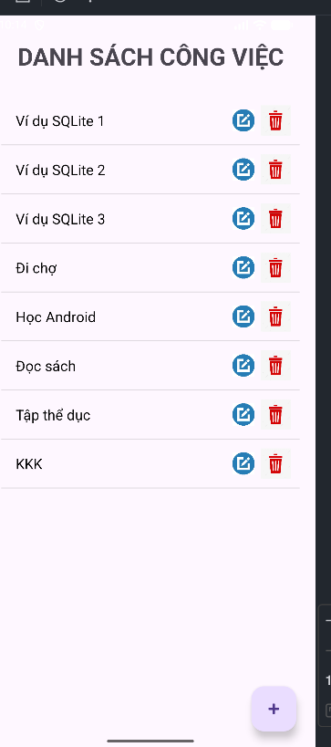
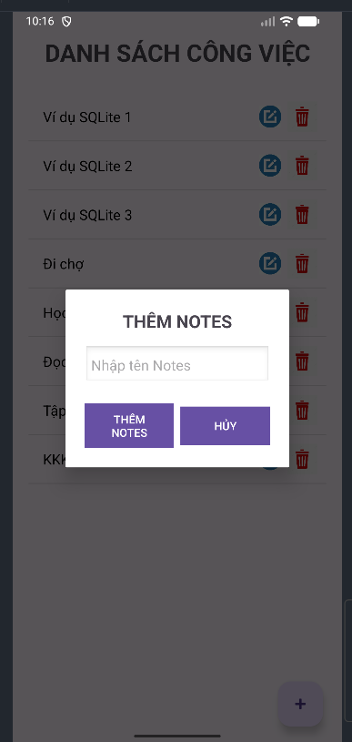
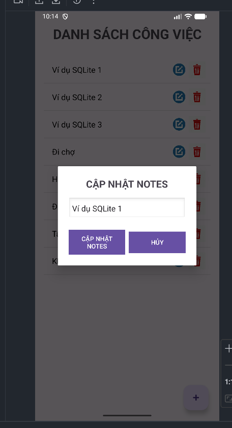
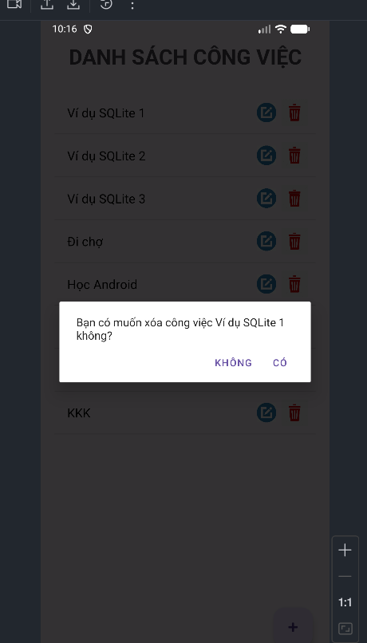

## Tính năng

- Thêm ghi chú: Cho phép người dùng tạo ghi chú mới và lưu vào cơ sở dữ liệu cục bộ.
- Sửa ghi chú: Người dùng có thể chỉnh sửa nội dung ghi chú đã lưu.
- Xoá ghi chú: Xoá bỏ ghi chú không cần thiết khỏi danh sách.
- Xem ghi chú: Hiển thị toàn bộ ghi chú đã lưu để dễ dàng quản lý và tìm kiếm.

## Ngôn ngữ & Công nghệ

- Kotlin
- Java
- Android SDK
- SQLite
- Gradle

## Hình ảnh demo

